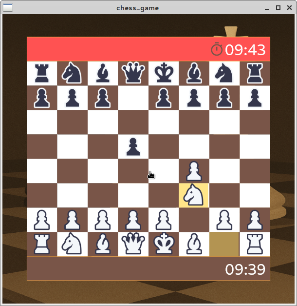

# Chess Game

A simple and interactive chess game built with Flutter.

> **Note:** This game is currently in **beta**.

---

## Features

- Classic chess gameplay
- User-friendly interface
- Move validation
- Responsive design for all devices

---

## Screenshots

### Desktop

<p align="center">
    
    
</p>

### Mobile

<p align="center">
    
    
</p>

---

## Getting Started

1. **Clone the repository:**
        ```
        git clone https://github.com/yourusername/chess_game.git
        cd chess_game
        ```

2. **Install dependencies:**
        ```
        flutter pub get
        ```

3. **Run the app:**
        ```
        flutter run
        ```

---

### Third-Party Assets Attribution

#### Chess Piece Images

- **Asset:** Chess pieces (images only)
- **Source:** [NFT Marketplace UI Kit – Figma Community](https://www.figma.com/community/file/971870797656870866)
- **Author:** Ali Murtaza  
- **License:** [Creative Commons Attribution 4.0 International (CC BY 4.0)](https://creativecommons.org/licenses/by/4.0/)  
- **Usage:** Only the chess piece images from this UI kit are used in this project, possibly with modifications.

> ⚠️ If you fork or reuse this project and **remove or replace the chess piece images**, this attribution is no longer required.

---

## Contributing

Contributions are welcome! Please open issues or submit pull requests for improvements.

---

## License

This project is licensed under the MIT License.
